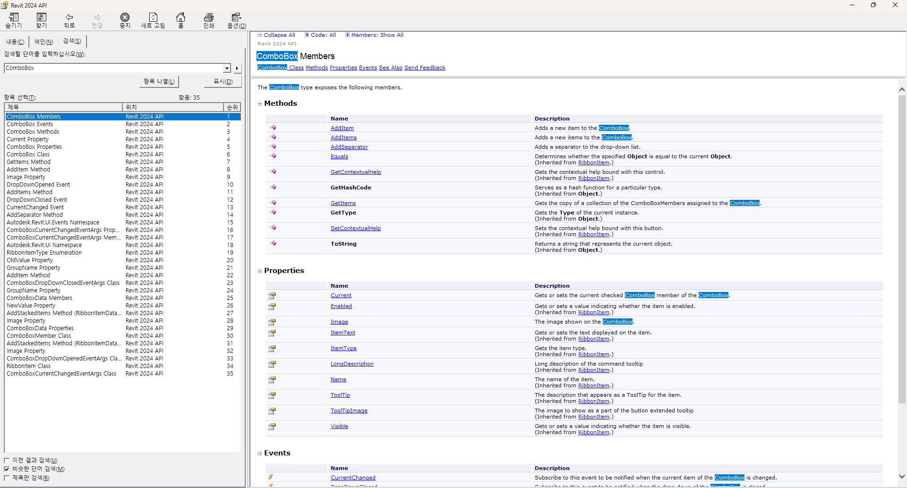
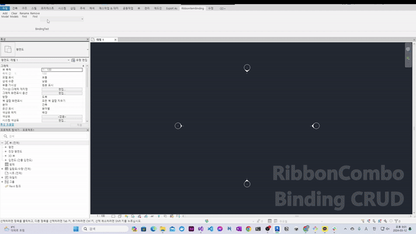

<H1>04_Set Binding on ComboBox of Ribbon</H1>

In Revit API, there is no method to set binding data to ComboBox of Ribbon
(Like the binding of WPF-MVVM Structure).

As reading the document of API, there is only "Adding" method.

Actually, AdWindows.dll is the library for calling API on AutoCAD Environment, not for Revit. But, some class is can be converted to the class of AdWindows.

If you are understanding the data binding(mostly used at MVVM Project of WPF), you would be able to apply full CRUD on ComboBox.
